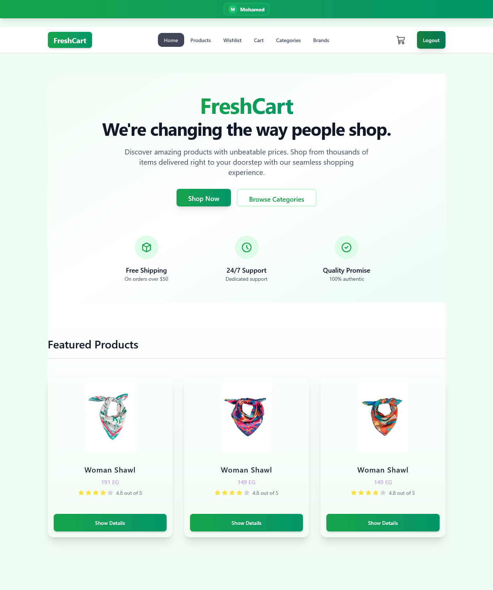
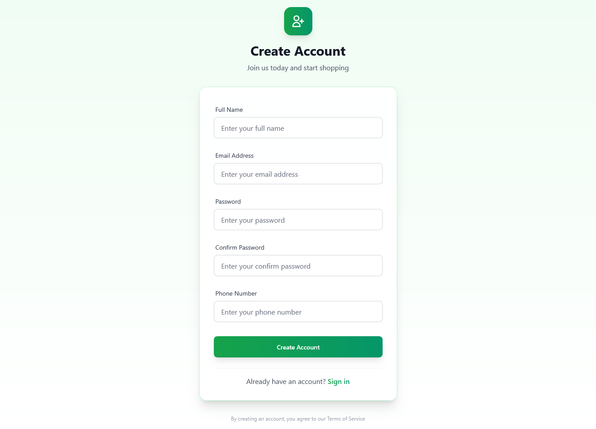
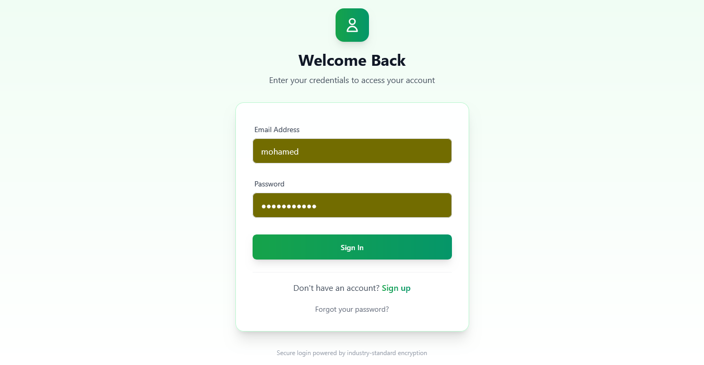
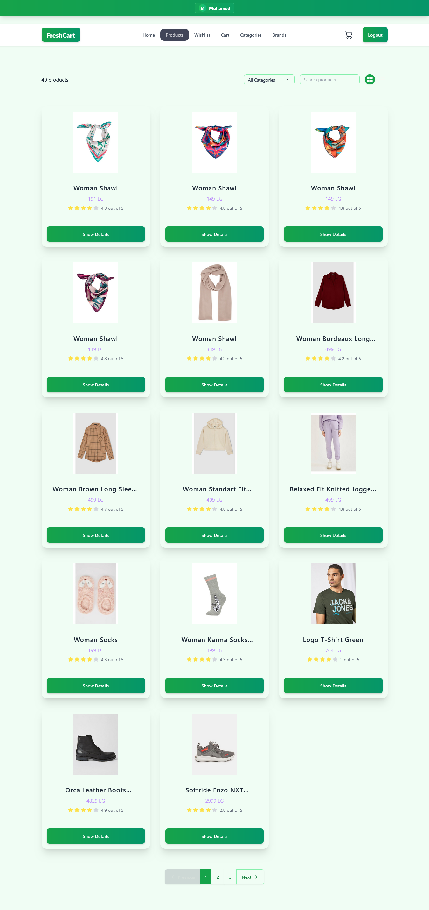
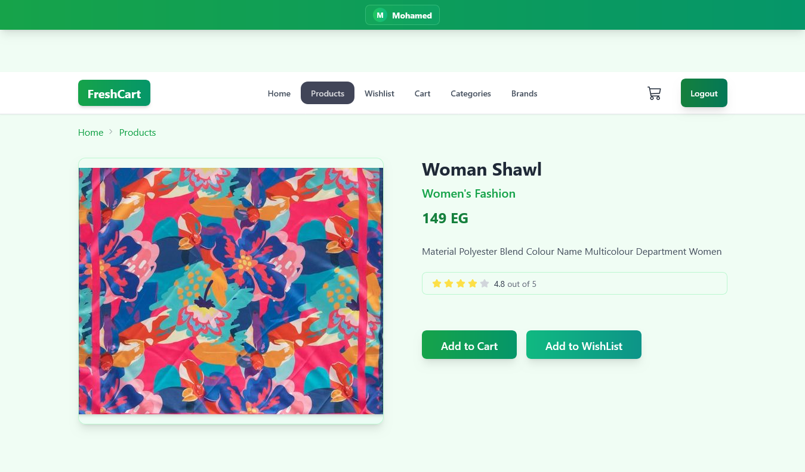
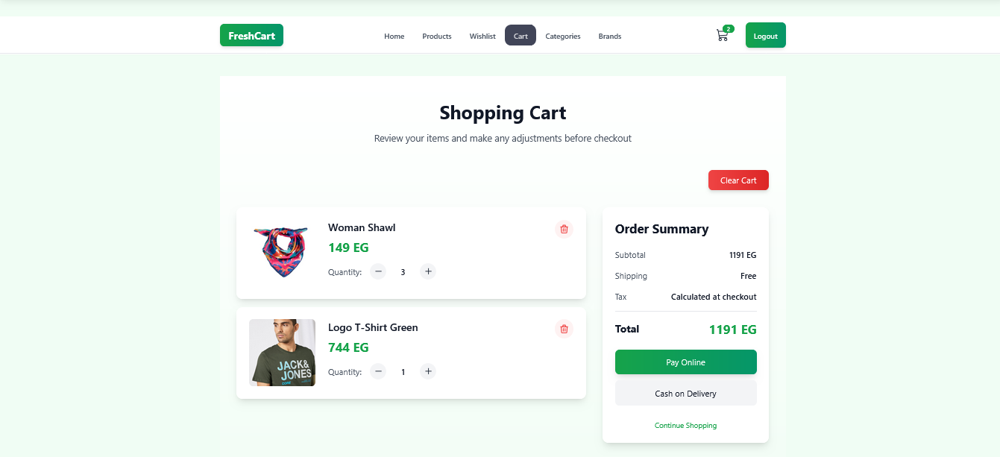

# 🛒 Modern E-commerce Web Application

> A **production-ready e-commerce frontend application** built with **React 18 and Vite**, designed to showcase real-world frontend development skills, clean architecture, and modern best practices used in professional teams.

---

## 📸 Application Screenshots

Below is a walkthrough of the main user flow, with each screen explaining its purpose clearly:

### 🏠 Home Page
Displays featured products, categories, and the main entry point of the application.


### 📝 Register Page
Allows new users to create an account with form validation and user-friendly feedback.


### 🔐 Login Page
Enables existing users to securely log in to the application.


### 🛍️ Products Page
Shows the full list of available products with a clean and responsive layout.


### 📄 Product Details Page
Provides detailed information about a selected product including price and description.


### 🛒 Cart Page
Displays selected products, quantities, and total price before checkout.


### 💳 Online Payment Page
Simulates the online payment flow and checkout process.


---

## 🚀 Project Overview

This project represents a modern e-commerce platform focusing on **performance**, **scalability**, and **user experience**. It demonstrates how a Front-End Developer structures a real application, manages state efficiently, and builds reusable UI components.

---

## ✨ Features

* Fully responsive and mobile-first UI
* Product listing with optimized rendering
* Product details pages with dynamic routing
* Shopping cart functionality with global state
* User authentication pages (Register & Login UI)
* Online payment flow (UI implementation)
* Form validation and user feedback notifications
* SEO-friendly page structure

---

## 🧠 Technical Highlights

* Component-based architecture
* Clean and scalable folder structure
* Global state management using Redux Toolkit
* Server-state handling with React Query
* Efficient API communication using Axios
* Reusable UI components and hooks
* Code quality enforced with ESLint

---

## 🛠️ Tech Stack

* **React 18**
* **Vite** (Fast development & optimized builds)
* **Context** (State management)
* **React Router DOM** (Routing)
* **React Query** (Data fetching & caching)
* **Tailwind CSS & DaisyUI** (Styling & UI components)
* **Axios** (HTTP requests)
* **Formik & Yup** (Forms & validation)

---

## ⚙️ Installation & Setup

```bash
# Clone the repository
git clone https://github.com/USERNAME/REPO_NAME.git

# Navigate to project directory
cd REPO_NAME

# Install dependencies
npm install

# Run development server
npm run dev
```

---

## 🏗️ Build for Production

```bash
npm run build
```

---

## 👀 Preview Production Build

```bash
npm run preview
```

---

## 📈 Future Enhancements

* Full authentication & authorization logic
* Secure payment gateway integration
* Wishlist functionality

---
